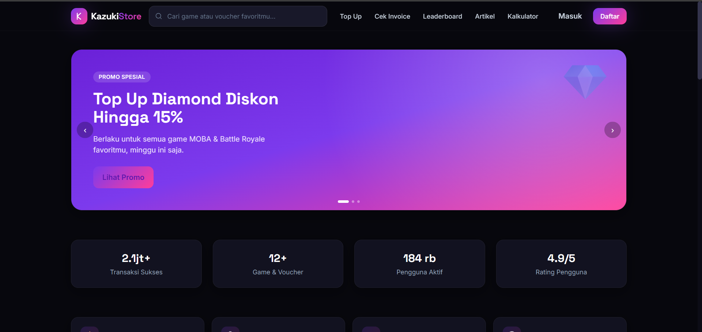

<div align="center">

# ⚔️ KazukiStore

**Platform Top Up Game Modern**

Simulasi pengalaman platform top up game production-ready, dibangun dari nol dengan Vue 3, TypeScript, dan Tailwind CSS.

[Fitur](#-fitur-utama) · [Tech Stack](#-tech-stack) · [Instalasi](#-instalasi--menjalankan-project) · [Struktur](#-struktur-project)

</div>

---

## 📖 Tentang Project

**KazukiStore** adalah website top up game bertema gaming premium dengan dark theme, dibuat sebagai project portfolio untuk menunjukkan kemampuan Front-End Development modern. Project ini mensimulasikan seluruh user flow platform top up sungguhan — mulai dari memilih game, memasukkan ID akun, checkout, simulasi pembayaran, hingga cek invoice — tanpa memerlukan backend atau payment gateway eksternal.

Seluruh data (daftar game, nominal top up, artikel, leaderboard) menggunakan **mock data terstruktur**, dan transaksi disimulasikan sepenuhnya di sisi client menggunakan Pinia + localStorage, sehingga project dapat dijalankan secara mandiri untuk keperluan demo.

## 📸 Preview



## ✨ Fitur Utama

- 🏠 **Homepage** — Hero banner carousel, statistik, game populer, kategori, dan artikel terbaru
- 🔍 **Navbar & Pencarian** — Live search game dengan dropdown hasil instan
- 🎮 **Daftar & Kategori Game** — Filter kategori, pencarian, dan sorting
- 🧾 **Detail Game** — Form ID akun dinamis, pilihan nominal, dan game serupa
- 💳 **Checkout & Pembayaran** — QRIS, e-wallet, virtual account, retail dengan kalkulasi biaya otomatis
- ⏳ **Simulasi Pembayaran** — Timer countdown dan simulasi status (berhasil/gagal)
- 🧾 **Invoice & Riwayat Transaksi** — Cek invoice by ID + riwayat tersimpan di localStorage
- 🔐 **Login & Register** — Autentikasi simulasi (tanpa backend)
- 🏆 **Leaderboard** — Top 10 pembelian (harian/mingguan/bulanan)
- 🧮 **Kalkulator** — Estimator Win Rate, Magic Wheel, dan Season Pass
- 📰 **Artikel & Berita** — Listing + detail artikel dengan kategori dan pencarian
- 📱 **Fully Responsive** — Mobile, tablet, dan desktop
- 🌙 **Dark Theme** — Visual identity gelap dengan aksen gradient ungu-pink

## 🛠 Tech Stack

| Kategori         | Teknologi                                                        |
| ---------------- | ---------------------------------------------------------------- |
| Framework        | [Vue 3](https://vuejs.org/) (Composition API + `<script setup>`) |
| Bahasa           | [TypeScript](https://www.typescriptlang.org/)                    |
| Build Tool       | [Vite 5](https://vitejs.dev/)                                    |
| Styling          | [Tailwind CSS 3](https://tailwindcss.com/)                       |
| State Management | [Pinia](https://pinia.vuejs.org/)                                |
| Routing          | [Vue Router 4](https://router.vuejs.org/)                        |
| Persistensi Demo | `localStorage` (auth & riwayat transaksi)                        |

Tidak ada dependency tambahan yang tidak diperlukan — seluruh visual (cover game, ikon artikel) dirender menggunakan CSS gradient + emoji, sehingga project berjalan 100% mandiri tanpa API gambar eksternal.

## 📂 Struktur Project

```
kazukistore/
├── public/
│   └── favicon.svg
├── src/
│   ├── assets/
│   ├── components/
│   │   ├── common/        # GameCard, ArticleCard, GameCover, StatusBadge
│   │   ├── home/           # HeroBanner, TrustFeatures, CategoryChips
│   │   └── layout/         # AppNavbar, AppFooter
│   ├── composables/
│   │   └── useCurrency.ts  # Formatter IDR, tanggal, angka
│   ├── data/                # Mock data (games, articles, leaderboard, payment methods)
│   ├── router/
│   │   └── index.ts         # Definisi seluruh route + lazy loading
│   ├── stores/
│   │   ├── auth.ts          # Simulasi login/register/logout
│   │   └── transaction.ts   # Draft checkout, riwayat, simulasi pembayaran
│   ├── types/
│   │   └── index.ts         # Semua interface & type TypeScript
│   ├── views/                # 13 halaman utama
│   ├── App.vue
│   ├── main.ts
│   └── style.css            # Tailwind layers + design tokens KazukiStore
├── index.html
├── tailwind.config.js
├── vite.config.ts
├── tsconfig.json
└── package.json
```

## 🚀 Instalasi & Menjalankan Project

**Prasyarat:** Node.js 18+ dan npm.

```bash
# 1. Ekstrak project lalu masuk ke folder
cd kazukistore

# 2. Install dependency
npm install

# 3. Jalankan development server
npm run dev
```

Project akan berjalan di `http://localhost:5173`.

## 📦 Build Production

```bash
# Type-check + build ke folder dist/
npm run build

# Preview hasil build secara lokal
npm run preview
```

## 🗺 Roadmap Pengembangan (opsional)

Struktur project ini disiapkan agar mudah dikembangkan lebih lanjut, misalnya:

- Integrasi backend/API sungguhan (REST/GraphQL) menggantikan mock data
- Integrasi payment gateway nyata (Midtrans, Xendit, dll.)
- Autentikasi berbasis JWT/session sungguhan
- Dashboard admin untuk mengelola game & harga
- Internasionalisasi (i18n) untuk multi-bahasa

<div align="center">

Dibuat dengan ❤️ oleh **Ardi Wirya**

</div>
